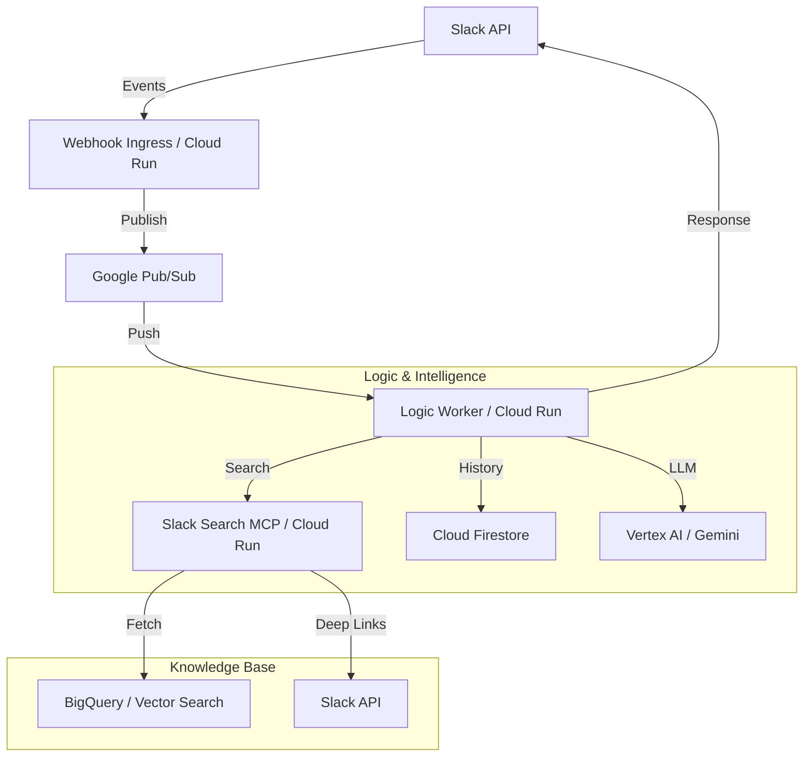

# System Architecture

AIBot is a modular, event-driven Slack application built on Google Cloud Platform (GCP). It leverages Large Language Models (LLMs) via Vertex AI and follows a microservices pattern for scalability and robustness.

## High-Level Diagram

## Component Overview

### 1. Webhook Ingress (`aibot-webhook`)
The entry point for all Slack interactions.
- **Function**: Receives events (mentions, DMs, Home tab) and interactivity (buttons) from Slack.
- **Security**: Verifies Slack cryptographic signatures via middleware.
- **Asynchronicity**: Immediately acknowledges Slack (to prevent 3000ms timeouts) and publishes the payload to a Pub/Sub topic for processing.

### 2. Logic Worker (`aibot-logic`)
The "brain" of the application.
- **Function**: Orchestrates the multi-agent system.
- **Agents**:
    - **Supervisor Agent**: The main orchestrator that analyzes user intent and delegates tasks.
    - **Slack Search Agent**: Specialised in searching historical conversations.
- **Session Management**: Automatically tracks conversation history in Firestore, allowing for natural, multi-turn follow-up questions within Slack threads.

### 3. Slack Search MCP (`slack-search-mcp`)
A search service implementing the **Model Context Protocol (MCP)**.
- **Function**: Performs semantic vector searches across archived Slack messages.
- **Data Source**: BigQuery (Vector Index).
- **Optimization**: Uses `asyncio` to fetch conversation threads in parallel, ensuring search results include full context and deep links.

### 4. Persistence & Security
- **Cloud Firestore**: Stores conversation history and encrypted Google OAuth tokens.
- **Google Cloud Secret Manager**: Centralized storage for Slack tokens, Client IDs, and application configuration.
- **Identity-Aware Proxy (IAP)**: Protects the internal MCP endpoint, requiring OIDC token authentication for cross-service calls.

## Data Flow: Handling a User Query

1. **Ingress**: User mentions @AIBot in Slack. The `webhook` service receives the `app_mention`.
2. **Buffer**: Payload is pushed to Pub/Sub.
3. **Trigger**: Pub/Sub triggers the `logic-worker`.
4. **Agent Loop**:
    - Supervisor receives the query and decides to use the `SlackSearchAgent`.
    - `SlackSearchAgent` calls the MCP tool.
    - MCP server performs Vector Search in BigQuery and returns relevant message threads.
5. **Synthesis**: Supervisor summarizes the search results into a concise, formatted Slack response.
6. **Delivery**: The response is posted back to the original Slack thread.
